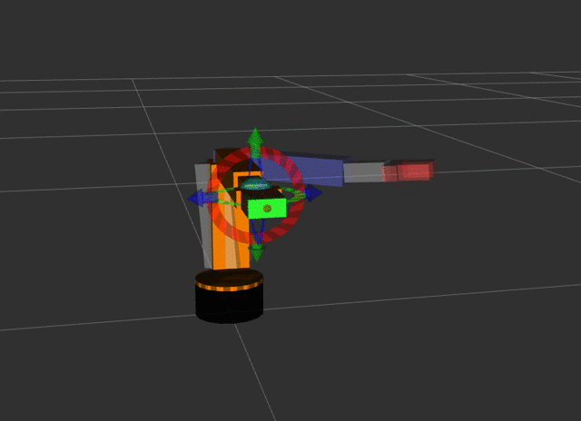
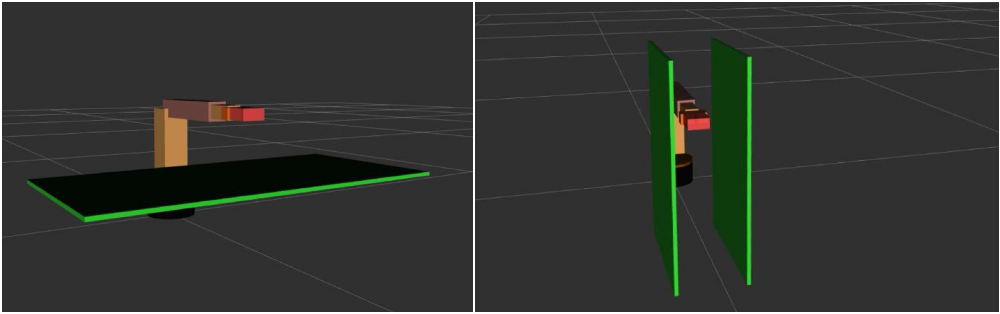
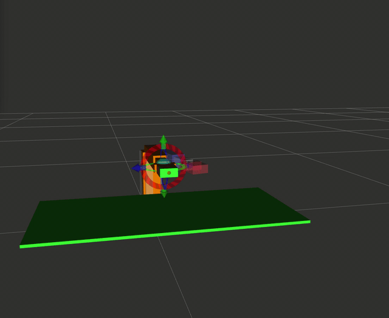
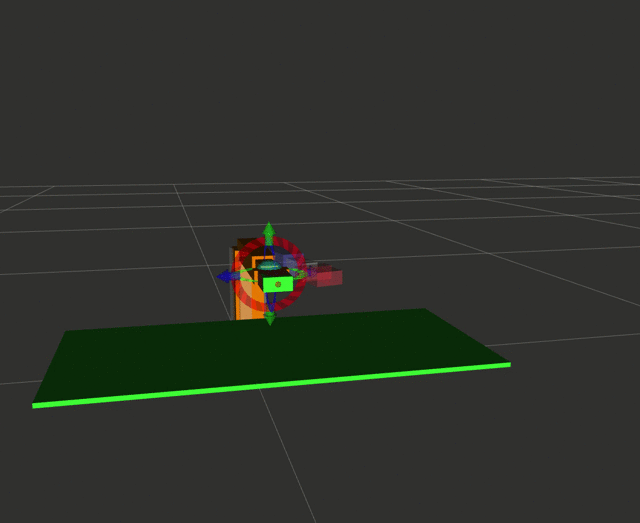
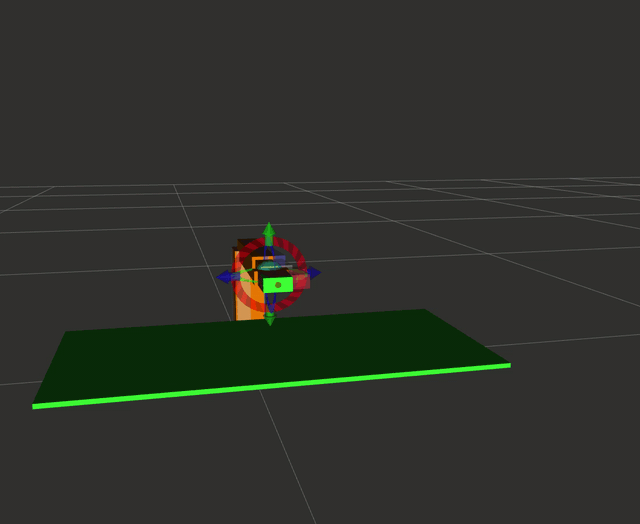
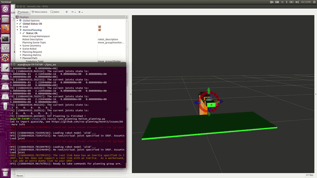

# Path Planning for Lynx Robots on ROS/Gazebo
This is a path planning for Lynx robot based on Gazebo and ROS

<p align="center">
   

</p>


## Proposal

The goal and our method : [Proposal](docs/proposal.pdf)   
We would like to achive some planning method such as RRT, RRT* and SST to our simulator


## Part One: Gazebo Model

We refer to the urdf file in this repo https://github.com/gdepaepe/al5d_description


### 1. Parameters of the robot

we have check the robot parameters of the model with 5l5d, we did not revise it as this model has more size information than what we've done in class.

which is in lynx_descripton/lynx.xacro
```
    <xacro:property name="base_height" value="0.043" />
    <xacro:property name="base_radius" value="0.048" />
    <xacro:property name="upper_base_height" value="0.006" />
    <xacro:property name="upper_arm_offset" value="0.022" />
    <xacro:property name="upper_arm_length" value="0.14605" />    <!-- a2=146.05 -->
    <xacro:property name="upper_arm_width" value="0.05" />
    <xacro:property name="lower_arm_length" value="0.187325" />    <!-- a3=187.32 -->
    <xacro:property name="lower_arm_width" value="0.035" />
    <xacro:property name="wrist_length" value="0.055" />
    <xacro:property name="wrist_width" value="0.025" />
    <xacro:property name="gripper_length" value="0.06" />
    <xacro:property name="gripper_width" value="0.05" />
    <xacro:property name="gripper_height" value="0.02" />
    <xacro:property name="finger_length" value="0.04" />
```


### 2.Usage

#### (1) Install ROS, Gazebo and Moveit!

There are two version of ROS, and we choose the kinetic version. [Installation of ROS](http://wiki.ros.org/ROS/Installation)


Installation of Gazebo
```
curl -sSL http://get.gazebosim.org | sh
```

Installation of Moveit!
```
sudo apt-get install ros-kinetic-moveit
```
#### (2) Set up the ros workspace

ROS tutorial here: [Creating a workspace for catkin](http://wiki.ros.org/catkin/Tutorials/create_a_workspace)

```
mkdir lynx_ws/src
cd mkdir lynx_ws/src
git clone https://github.com/yuwei-wu/Motion-Planning-for-Lynx.git
catkin_make
```

remember to source or add path in .bashrc file

```
source devel/setup.bash
source /opt/ros/kinetic/setup.bash
```


#### (3) Launch Gazebo Model

```
roslaunch lynx_gazebo lynx_gazebo.launch
```

<p align="center">
   
</p>


## Part Two: Manipulation with MoveIt!

we use moveit to build the robot driver and moveing group.

if you want to start from scratch, you can use the urdf file and the setup assistant.

```
roslaunch moveit_setup_assistant setup_assistant.launch
```
moveit has the Kinematic Solver as kdl_kinematics_plugin/KDLKinematicsPlugin, so we directly use it.   


run and try planning on MoveIt
```
roslaunch lynx_moveit demo.launch
```

<p align="center">
   
</p>


Although moveit has some useful motion planning method, we would like to test our motion planning on the simulation.


## Part Three: Motion Planning on Robot

### 1.Set the obstacles sence

There are three methods to add the obstacles. (1) add it in gazebo world (2) via python to add in planning scene (3) add the .scene file with moveit.   

We firstly build with gazebo and you can check lynx_gazebo/obs_model, but with better controller of MoveIt, we convert to use the .scene to add it. We use the map information in lab2 and create the scence file

for instance, the map2 obstacles: 
```
block 150 60  -50.0 400 66.7  350.0  
block 150 -66.7  -50.0 400 -60  350.0

```
Then we convert to moveit scene form: (in lynx_moveit/scenes/obs2.scene). For each box, row 1 is the the size of the obstacles and row 2 is the center of the obstacles.
```
obs2
 * obs2
 2
 box
 0.25 0.0067 0.4
 0.275 -0.06335 0.2
 0 0 0 1
 0 0 0 0
 box
 0.25 0.0067 0.4
 0.275 0.06335 0.2
 0 0 0 1
 0 0 0 0
 .

```

Finally, we add it to demo.launch

```
  <arg name="scene_file" default="$(find lynx_moveit)/scenes/obs2.scene"/> 
  <node name = "moveit_publish_scene_from_text" pkg= "moveit_ros_planning" type = "moveit_publish_scene_from_text" args= "$(arg scene_file)"/>
  
 ```

When you relaunch the demo.launch, you can see the obstacles in the environment, we set map1 and map2 in it: 

<p align="center">
   
</p>

### 2.Import the information of obstacles in python


### 3. RRT Path planning with static obstacles

The moveit has its default planning method, and we use different paths computed from previous labs and SST to test our result on it.    

You can run this command, and it will perform these four methods accordingly
```
rosrun lynx_planning motion_planning.py
```


The terminal will appear this:
```
[ INFO] [1588644280.556859246]: Ready to take commands for planning group arm.
[INFO] [1588644283.663095]: The current joints state is:
[ 0.  0.  0.  0.  0.  0.]
[INFO] [1588644283.863290]: The current joints state is:
[ 0.  0.  0.  0.  0.  0.]
[INFO] [1588644285.463268]: The current joints state is:
[  2.00000000e-01   2.22044600e-16   0.00000000e+00   0.00000000e+00
   0.00000000e+00   0.00000000e+00]
[INFO] [1588644287.062594]: The current joints state is:
[  4.00000000e-01   2.22044600e-16   0.00000000e+00   0.00000000e+00
   0.00000000e+00   0.00000000e+00]
[INFO] [1588644288.663085]: The current joints state is:
[  6.00000000e-01   2.22044600e-16   0.00000000e+00   0.00000000e+00
   0.00000000e+00   0.00000000e+00]
[INFO] [1588644290.263303]: The current joints state is:
[  8.00000000e-01   2.22044600e-16   0.00000000e+00   0.00000000e+00
   0.00000000e+00   0.00000000e+00]
[INFO] [1588644291.863217]: The current joints state is:
[  1.00000000e+00   2.22044600e-16   0.00000000e+00   0.00000000e+00
   0.00000000e+00   0.00000000e+00]
[INFO] [1588644293.663698]: The current joints state is:
[  1.20000000e+00   2.22044600e-16   0.00000000e+00   0.00000000e+00
   0.00000000e+00   0.00000000e+00]
[INFO] [1588644293.863530]: The current joints state is:
[ 1.2  0.   0.   0.   0.   0. ]
[INFO] [1588644294.063726]: The current joints state is:
[ 1.2  0.   0.   0.   0.   0. ]
[INFO] [1588644294.563793]: Astar Planning is Finished !
```

<p align="center">
    
</p>

<p align="center">
    
</p>

Actually in the matlab simulator, we consider the lynxmotion robot as teh line and does not include more contour information.  
Therefore the map2 planning looks like harder to perform in this simulation. 

## Part Four: Comparasion of Different Planner
 


