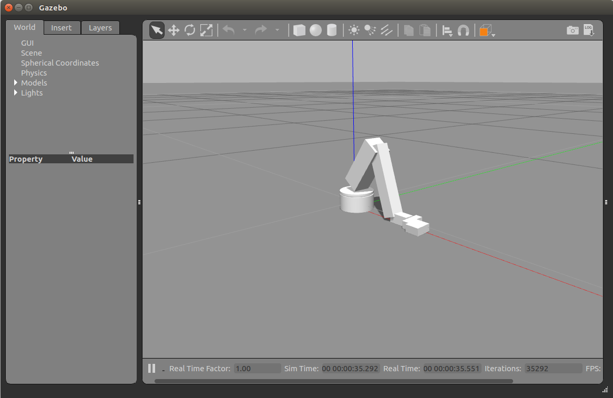
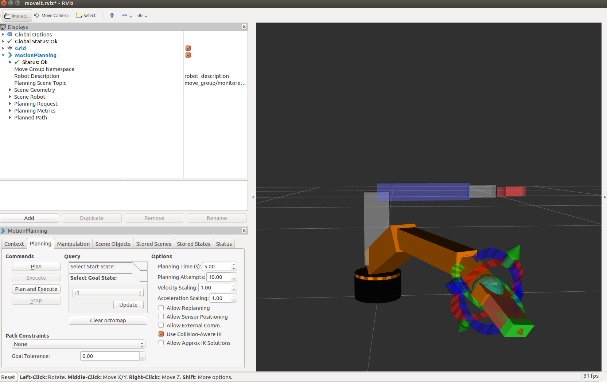

# Path Planning for Lynx Robots on ROS/Gazebo
This is a path planning for Lynx robot based on Gazebo and ROS

<p align="center">
   
</p>


## Proposal

The goal and our method : [Proposal](docs/proposal.pdf)   
We would like to achive some planning method such as RRT, RRT* and SST to our simulator


## Part One: Gazebo Model

We refer to the urdf file in this repo https://github.com/gdepaepe/al5d_description


### 1. Parameters of the robot

we have check the robot parameters of the model with 5l5d, we did not revise it as this model has more size information than what we've done in class.

which is in lynx_descripton/lynx.xacro
```
    <xacro:property name="base_height" value="0.043" />
    <xacro:property name="base_radius" value="0.048" />
    <xacro:property name="upper_base_height" value="0.006" />
    <xacro:property name="upper_arm_offset" value="0.022" />
    <xacro:property name="upper_arm_length" value="0.14605" />    <!-- a2=146.05 -->
    <xacro:property name="upper_arm_width" value="0.05" />
    <xacro:property name="lower_arm_length" value="0.187325" />    <!-- a3=187.32 -->
    <xacro:property name="lower_arm_width" value="0.035" />
    <xacro:property name="wrist_length" value="0.055" />
    <xacro:property name="wrist_width" value="0.025" />
    <xacro:property name="gripper_length" value="0.06" />
    <xacro:property name="gripper_width" value="0.05" />
    <xacro:property name="gripper_height" value="0.02" />
    <xacro:property name="finger_length" value="0.04" />
```


### 2.Usage

#### (1) Install ROS, Gazebo and Moveit!

There are two version of ROS, and we choose the kinetic version. [Installation of ROS](http://wiki.ros.org/ROS/Installation)


Installation of Gazebo
```
curl -sSL http://get.gazebosim.org | sh
```

Installation of Moveit!
```
sudo apt-get install ros-kinetic-moveit
```
#### (2) Set up the ros workspace

ROS tutorial here: [Creating a workspace for catkin](http://wiki.ros.org/catkin/Tutorials/create_a_workspace)

```
mkdir lynx_ws/src
cd mkdir lynx_ws/src
git clone https://github.com/yuwei-wu/Motion-Planning-for-Lynx.git
catkin_make
```

remember to source or add path in .bashrc file

```
source devel/setup.bash
source /opt/ros/kinetic/setup.bash
```


#### (3) Launch Gazebo Model

```
roslaunch lynx_gazebo lynx_gazebo.launch
```

<p align="center">
   
</p>


## Part Two: Manipulation with MoveIt!

we use moveit to build the robot driver and moveing group.

if you want to start from scratch, you can use the urdf file and the setup assistant.

```
roslaunch moveit_setup_assistant setup_assistant.launch
```

run and try planning on MoveIt
```
roslaunch lynx_moveit demo.launch
```

<p align="center">
   
</p>


Although moveit has some useful motion planning method, we would like to test our motion planning on the simulation.


## Part Three: Motion Planning on Robot

### 1.Set the obstacles sence


### 2.Import the information of obstacles in python


### 3. RRT Path planning with static obstacles


## Part Four: comparasion of 
 
 
 
 
## Reference


